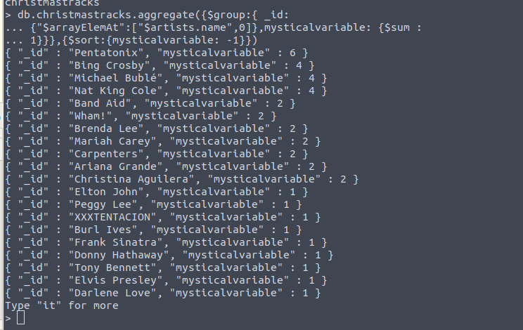

1. db.christmastracks.aggregate({$group:{ _id:
{"$arrayElemAt":["$artists.name",0]},mysticalvariable: {$sum :
1}}},{$sort:{mysticalvariable: -1}})
```
1.get the first artist' name as the _id's key-value of the new group, count the number of this artist's tracks, and give this value to new variable "mysticalvariable", and then output this new collection with descending sort.
```
Result 1:



2. db.christmastracks.updateMany({popularity: {$gte:
80}},{$set:{"artists.$[].type":"famous artist"}},{})
```
2.first get the tracks which the popularity greater than 80, then set a new element "type" in these "artists" collection, and set the value as "famous artist".
```
Result 2:

[second picture 1]:image/Screenshot2-1.png
[second picture 2]:image/Screenshot2-2.png
[second picture 3]:image/Screenshot2-3.png
![second picture 1]
![second picture 2]
![second picture 3]


3. db.christmastracks.update({available_markets:{$in:['DE']}},{$set:{"available_markets.$[country]":"Deutschland"}},{upsert:true,multi:true,arrayFilters:[{"country":'DE'}]})
```
3.first query the available_markets with 'DE', then change the 'DE' in "available_markets" to "Deutschland", next creates a new document when no document matches the query criteria and updates multiple documents that meet the query criteria.  
```
Reslut 3:

[third picture 1]:image/Screenshot3-1.png
[third picture 2]:image/Screenshot3-2.png
[third picture 3]:image/Screenshot3-3.png
![third picture  1]
![third picture  2]
